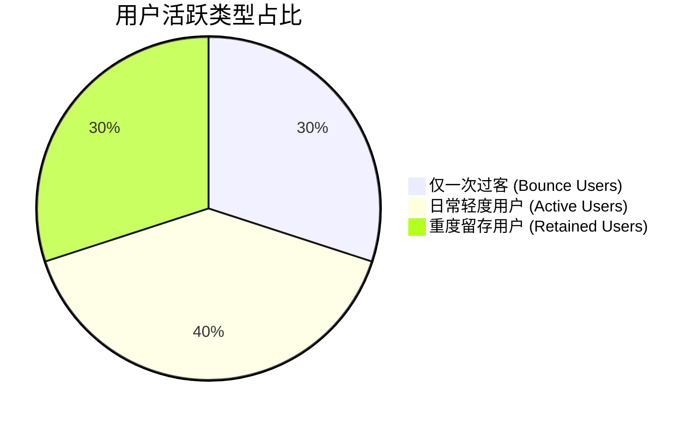

# X-Flow Telemetry 数据分析看板 📊

> **生成时间**: 2026-05-27 07:42:59 UTC
> **数据范围**: 历史全量数据 (Cloudflare D1)

---

## 📊 大盘核心数据 KPI

| 指标名称 | 数据统计 | 行业/业务参考 |
| :--- | :--- | :--- |
| **总匿名用户数 (Users)** | `10` | 激活安装脚本的唯一客户端数 |
| **总互动次数 (Interactions)** | `18` | 点赞、收藏、下载等明确动作总和 |
| **总播放 Session 数** | `10` | 用户观看视频的心跳回传记录数 |

---

## 👥 用户群体画像与留存

### 1. 活跃与粘性等级 (Sticky User Cohorts)



* 😴 **仅一次过客 (Bounce)** (访问过 1 次): `3` 人 (`30.0%`)
* 🏃 **日常/轻度用户** (访问过 2-4 次): `4` 人 (`40.0%`)
* 🔥 **重度留存用户 (Sticky)** (访问过 >= 5 次): `3` 人 (`30.0%`)

> [!TIP]
> 重度留存用户占比反映了脚本的长期健康度。若该比例持续增长，说明全屏滑动体验对老用户极具吸引力。

### 2. 活跃时间段分布

| 活跃时段 | 用户数 | 占比 | 标签说明 |
| :--- | :--- | :--- | :--- |
| **🌅 清晨 (Early Morning, 2:00-6:00)** | `2` | `20.0%` | 极度夜猫子 / 早起党 |
| **☀️ 上午 (Morning, 6:00-12:00)** | `2` | `20.0%` | 日间轻度浏览 |
| **🌤️ 下午 (Afternoon, 12:00-18:00)** | `2` | `20.0%` | 午休及通勤时段 |
| **🌆 晚上 (Evening, 18:00-22:00)** | `2` | `20.0%` | 黄金活跃期 |
| **🌙 深夜 (Late Night, 22:00-2:00)** | `2` | `20.0%` | 重度夜游人群 |

---

## 🎬 视频播放与完播分析

### 1. 平均播放表现

* **平均每次观看时长**: `28.2` 秒
* **平均视频完播率**: `59.6%`

### 2. 完播率区间分布 (Completion Rate Distribution)

```mermaid
gantt
    title 完播率区间分布次占比
    dateFormat  X
    axisFormat %
    section 秒退 (<10%) : 0, 20
    section 简阅 (10%-50%) : 0, 10
    section 深阅 (50%-90%) : 0, 20
    section 完播 (>=90%) : 0, 50
```

* **秒退 (Bounce, <10%)**: `2` 次 (`20.0%`) — 用户滑过或迅速划走
* **简阅 (Brief View, 10%-50%)**: `1` 次 (`10.0%`) — 停留观看了视频前半段
* **深度阅读 (Partial View, 50%-90%)**: `2` 次 (`20.0%`) — 观看了大半，基本看完
* **完播 (Completed, >=90%)**: `5` 次 (`50.0%`) — 观看了完整视频或循环播放

> [!NOTE]
> 秒退率反映了视频开头的抓人程度；完播率高低则直接决定了推荐的权重。

---

## ❤️ 互动行为大盘

| 行为类型 | 触发总次数 | 占大盘互动比例 | 意图强度与权重 |
| :--- | :--- | :--- | :--- |
| **📥 下载视频 (download)** | `2` | `11.1%` | 最强意图 (权重: 5.0) |
| **🔖 收藏视频 (bookmark_add)** | `3` | `16.7%` | 强意图 (权重: 3.0) |
| **❤️ 点赞视频 (like)** | `6` | `33.3%` | 中意图 (权重: 2.0) |
| **👁️ 开始浏览 (view_start)** | `7` | `38.9%` | 基础浏览意图 (权重: 0.5) |

---

## 🔥 全局 Trending 热门视频 (Top 10)

| 排名 | 视频 ID | 频道 | 综合热度得分 |
| :--- | :--- | :--- | :--- |
| **1** | `vid_real_1` | `real` | `18.49` |
| **2** | `vid_anime_1` | `anime` | `15.23` |
| **3** | `vid_real_2` | `real` | `10.29` |
| **4** | `vid_anime_3` | `anime` | `5.50` |
| **5** | `vid_anime_2` | `anime` | `3.71` |

---

## ⚙️ 系统推荐健康度

* **推荐算法覆盖率 (D1 Pre-cached)**: `100.0%` (全部已知用户已在 D1 中建立了 CF + Trending 的专属缓存)
* **已提取高光时刻的视频数**: `0` 个
* **全局兜底状态**: `GLOBAL_DEFAULT` 缓存建立成功 🌟 (实现冷启动用户 0ms 完美响应)

