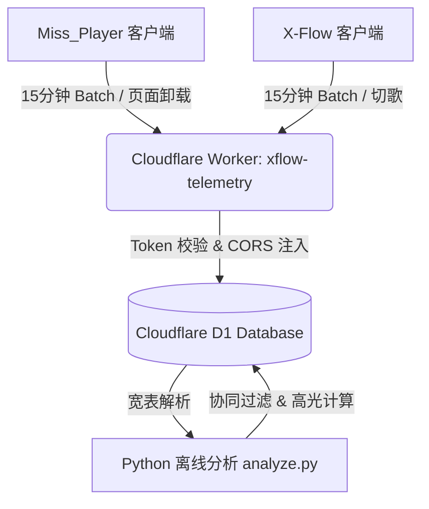

# Miss_Player & X-Flow 统一遥测系统设计书 v2.0

> **文档状态**: 架构定稿 & 线上部署运行中  
> **更新时间**: 2026-07-25  
> **适用项目**: Miss_Player (油猴脚本) & X-Flow (全屏流媒体用户脚本)  
> **后端基础设施**: Cloudflare Workers + Cloudflare D1 (SQLite)

---

## 1. 架构设计背景与目标

在过去版本中，遥测系统采用“单条行为立即上报、单表存储行为明细”的模式，导致以下严重痛点：
1. **D1 数据库写配额爆表**：用户每次播放、点击按钮均触发一次 HTTP POST + D1 INSERT，极易耗尽免费额度。
2. **数据表碎片化严重**：分布式存储 `users`, `interactions`, `play_sessions` 等多张表，联表查询分析性能低下。
3. **Twitter/twimg 视频 ID 丢失无法还原**：视频 ID 仅保留纯数字部分，导致推荐算法输出的 ID 无法恢复完整播放 CDN URL。

**v2.0 重构核心目标**：
- **Session JSON 宽表融合**：前端按 15 分钟/页面关闭进行内存 Batch 聚合，按小时生成 `session_id`。
- **D1 写入次数降低 98%+**：采用 SQLite `INSERT ... ON CONFLICT(session_id) DO UPDATE`，同一终端一小时仅更新 1 行宽表。
- **规范化 Video ID (Canonical Video ID)**：保留包含完整相对路径的 URL 结构（如 `amplify_video/2079457168697577472/...`），确保播放器 100% 可还原。

---

## 2. 系统整体架构



---

## 3. D1 数据库 Schema 设计

系统共享同一个 D1 实例，使用表名前缀进行隔离：
- **Miss_Player 表**：`mp_sessions`, `mp_users`
- **X-Flow 表**：`xf_events`, `xf_recommendations`

### 3.1 Miss_Player 数据表

#### `mp_sessions` (会话与行为聚合宽表)
```sql
CREATE TABLE IF NOT EXISTS mp_sessions (
    client_id       TEXT NOT NULL,                       -- 确定性终端指纹 UUID
    session_id      TEXT PRIMARY KEY,                    -- mp_${client_id}_${date}_${hour}
    date            TEXT NOT NULL,                       -- YYYY-MM-DD
    ts              INTEGER NOT NULL,                    -- 最近更新时间戳 (ms)
    hour_of_day     INTEGER NOT NULL,                    -- 0-23
    host            TEXT,                                -- 宿主域名 (如 missav.ws)
    site_category   TEXT,                                -- 站点分类 (MISSAV / JABLE / JAVDB 等)
    script_version  TEXT,                                -- 脚本版本 (如 5.5.0)
    device_type     TEXT,                                -- 设备类型 (PC_Landscape / Mobile_Portrait)
    total_play_sec  INTEGER DEFAULT 0,                   -- 本 Session 累积播放时长 (秒)
    event_counts    TEXT DEFAULT '{}',                   -- 行为事件计数 JSON (如 {"player_open_success":2,"like":1})
    avcodes         TEXT DEFAULT '[]',                   -- 本 Session 访问的番号列表 JSON
    details_json    TEXT DEFAULT '{}'                    -- 里程碑事件与异常 JSON
);
```

#### `mp_users` (用户画像与留存表)
```sql
CREATE TABLE IF NOT EXISTS mp_users (
    client_id       TEXT PRIMARY KEY,                    -- 确定性终端指纹 UUID
    first_seen      INTEGER NOT NULL,                    -- 首次访问时间 (ms)
    last_seen       INTEGER NOT NULL,                    -- 最近访问时间 (ms)
    session_count   INTEGER DEFAULT 1,                   -- 启动次数
    dominant_period TEXT,                                -- 偏好时段 (late_night / evening 等)
    user_agent      TEXT,                                -- User-Agent 字符串
    device_fp       TEXT                                 -- 浏览器硬件指纹
);
```

### 3.2 X-Flow 数据表

#### `xf_events` (全屏流媒体行为与视频热度宽表)
```sql
CREATE TABLE IF NOT EXISTS xf_events (
    anon_id         TEXT NOT NULL,                       -- 确定性匿名 ID (xf_${md5})
    session_id      TEXT PRIMARY KEY,                    -- xf_${anon_id}_${date}_${hour}
    date            TEXT NOT NULL,                       -- YYYY-MM-DD
    ts              INTEGER NOT NULL,                    -- 最近更新时间戳 (ms)
    channel         TEXT DEFAULT 'real',                 -- 频道 (real / anime)
    site_key        TEXT,                                -- 站点标识 (truvaze / x-ero-anime)
    version         TEXT,                                -- 脚本版本 (如 8.5.0)
    total_play_sec  INTEGER DEFAULT 0,                   -- 累积播放时长
    action_counts   TEXT DEFAULT '{}',                   -- 交互行为计数 JSON
    video_heat      TEXT DEFAULT '{}'                    -- 视频热度与 10s 时间轴分桶 JSON
);
```

#### `xf_recommendations` (AI 推荐与高光时刻结果表)
```sql
CREATE TABLE IF NOT EXISTS xf_recommendations (
    anon_id         TEXT PRIMARY KEY,                    -- 用户匿名 ID 或 'GLOBAL_DEFAULT'
    rec_video_ids   TEXT NOT NULL,                       -- 推荐视频 ID 数组 JSON (如 ["amplify_video/..."])
    highlight_map   TEXT DEFAULT '{}',                   -- 高光片段 JSON (如 {"video_path": [{"start":10,"end":20}]})
    updated_at      INTEGER NOT NULL                     -- 算法更新时间戳
);
```

---

## 4. 规范化视频 ID 规范 (Canonical Video ID)

针对 `video.twimg.com` 格式的 MP4 地址，过去仅截取数字 ID（如 `2079457168697577472`）导致缺失目录与文件名，无法反向还原。

### 4.1 提取与还原算法 (`Helper.ts`)
```typescript
// 规范化提取：保留完整相对路径
export function getCanonicalVideoId(item: { id?: string; url_cd?: string; url?: string }): string {
    if (!item) return '';
    const url = item.url || '';
    if (url && url.includes('video.twimg.com')) {
        try {
            const u = new URL(url);
            const path = u.pathname.replace(/^\/+/, '');
            if (path && path.length > 5) return path;
        } catch {
            const match = url.match(/(amplify_video|ext_tw_video|tweet_video)\/.+$/i);
            if (match) return match[0].split('?')[0].replace(/^\/+/, '');
        }
    }
    return String(item.id || item.url_cd || '');
}

// 还原为播放 URL
export function resolveUrlFromCanonicalId(canonicalId: string): string {
    if (!canonicalId) return '';
    if (canonicalId.startsWith('http://') || canonicalId.startsWith('https://')) {
        return canonicalId;
    }
    if (canonicalId.includes('amplify_video/') || canonicalId.includes('ext_tw_video/') || canonicalId.includes('tweet_video/')) {
        return `https://video.twimg.com/${canonicalId}`;
    }
    return '';
}
```

---

## 5. 安全防护与 CORS 规范

1. **Token 时间窗口签名**：
   - 客户端计算 `token = simpleHash('XFLOW_v6_SECRET_' + ts)`。
   - Worker 验证时间差 `Math.abs(Date.now() - ts) <= 5分钟`。
2. **CORS 全网跨域开放**：
   - 由于 Miss_Player 运行在数十种不同域名（如 `missav.ai`, `jable.tv`）上，Worker 在回应请求时统一设置 `Access-Control-Allow-Origin: origin || '*'`。
